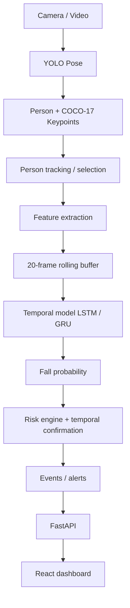

# PatientSafetyAI

Privacy-conscious hospital patient safety and **fall-risk monitoring** prototype.

This is an **academic / research** system for fall detection and early warning
using human pose keypoints and temporal models. It is **not** a clinically
validated medical device and must not be described as guaranteed medical-grade
fall prevention or diagnosis.

## Problem statement

Hospital falls are a major patient-safety concern. Continuous raw-video storage
raises privacy issues. PatientSafetyAI prefers:

```text
Camera / video
    → YOLO Pose (person + keypoints)
    → skeleton / keypoint analysis
    → temporal risk estimation
    → alerts + dashboard
```

over pipelines that archive identifiable raw video by default.

## Planned end-to-end architecture



## Current progress

| Stage | Status |
| --- | --- |
| UP-Fall dataset collected & inspected | Done |
| Label cleaning / skeleton analysis | Done |
| 20-frame sequences + subject-wise split | Done |
| Training-set normalization | Done |
| Baseline LSTM trained & evaluated | Done (baseline only) |
| YOLO Pose from raw video / webcam | Done |
| Skeleton visualization | Done |
| YOLO → UP-Fall feature bridge | Done (explicit **approximate** mapping; Z=0) |
| 20-frame rolling buffer + LSTM inference | Done |
| Risk engine / temporal confirmation | Done (prototype formula) |
| FastAPI event APIs | Done |
| React dashboard | Done (polls keypoints + risk; draws skeleton, not raw video) |
| LSTM operating-point sweep | Done (`scripts/tune_decision_threshold.py`) |

## Repository layout

```text
PatientSafetyAI/
├── config/config.yaml
├── datasets/
├── processed/
├── models/
├── src/
│   ├── pose/
│   ├── features/       # COCO-17, UP-Fall 99, buffer, train-stat normalize
│   ├── temporal/       # LSTM inference
│   ├── risk/
│   ├── alerts/
│   ├── tracking/
│   ├── zones/
│   ├── pipeline/       # FrameMonitor
│   └── utils/
├── backend/            # FastAPI
├── frontend/           # React (Vite)
├── scripts/
├── tests/
├── demo.py             # full pipeline demo
├── demo_pose.py        # pose-only demo
└── requirements.txt
```

Legacy inspection / preprocessing scripts at the repo root are **preserved**
(`inspect_*.py`, `clean_dataset.py`, `prepare_sequences.py`, `split_dataset.py`,
`normalize_data.py`, `train_lstm.py`, `evaluate_model.py`).

> **Note:** Some older scripts still contain absolute `D:\PatientSafetyAI\...`
> paths from earlier development. New code uses project-relative paths via
> `config/config.yaml` and `src/utils/paths.py`.

## Dataset (UP-Fall)

Uses the [UP-Fall Detection Dataset](https://sites.google.com/up.edu.mx/har-up/)
skeleton/keypoint CSVs.

**Representation used by the current LSTM:**

- 33 joints × `(X, Y, Z)` = **99 features per frame**
- Sequences: **20 frames**, step size 5 during preparation
- Subject-wise split:
  - Train: SUBJECT1–4 → 1122 sequences
  - Test: SUBJECT5 → 272 sequences
- Labels (binary, within A1–A5 fall recordings):
  - `0` ≈ fall-phase frames (minority)
  - `1` ≈ non-fall frames

Normalization uses **training statistics only** (`normalization_mean.npy`,
`normalization_std.npy`). Never recompute stats on the test set.

## Baseline LSTM (kept for comparison)

Files (local; may be gitignored):

- `models/upfall_lstm_best.keras`
- `models/upfall_lstm_final.keras`

Approximate subject-wise test metrics (baseline):

| Metric | Value |
| --- | --- |
| Accuracy | 62.87% |
| Precision | 88.11% |
| Recall | 67.36% |
| F1 | 76.35% |

Class 0 detection is weak under imbalance. This model is **not** production-ready.

### Critical feature-format warning

| Source | Format |
| --- | --- |
| UP-Fall LSTM | 33 joints × XYZ → shape `(20, 99)` |
| YOLO Pose | COCO-17 × (x, y, conf) |

These are **not interchangeable**. Live video uses an **explicit approximate**
mapping in `src/features/yolo_to_upfall.py` (derived Kinect-style 33 joints,
**Z = 0**, unused joints copied or zeroed). Training-set mean/std are then
applied. Live LSTM scores are **domain-shifted** and must not be compared
directly to the SUBJECT5 Kinect test metrics.

## Risk score (prototype)

Configurable weights in `config/config.yaml`:

```text
risk =
    w_lstm    * lstm_fall_probability     (1 - P(class=1); class 0 = fall)
  + w_posture * clip(torso_angle / 90°)
  + w_vertical* clip(downward hip velocity / v_ref)
  + w_height  * (1 - clip(body_height / h_ref))
  + w_aspect  * clip((bbox_width/height - 0.6) / 1.2)
  + w_zone    * zone_prior
```

If the LSTM is missing, remaining weights are renormalized. A **FALL_DETECTED**
event is emitted only if `risk >= fall_threshold` for `min_consecutive_frames`.
PRE-FALL / MEDIUM is a **heuristic state**, not a trained third class.

## YOLO Pose + full pipeline

```text
Video / webcam / image
    → YOLO11n-Pose (CPU)
    → person select / track
    → COCO-17 keypoints
    → approximate 99-dim vector + train-stat z-score
    → 20-frame buffer (stride 5)
    → LSTM P(fall)  +  pose signals
    → risk engine + confirmation
    → events (in memory)
```

### Install

```bash
pip install -r requirements.txt
```

Weights: `models/yolo11n-pose.pt` and `models/upfall_lstm_best.keras`.

### Demo

```bash
# Pose-only
python demo_pose.py --image datasets/samples/bus.jpg --no-display

# End-to-end risk HUD
python demo.py --source datasets/samples/bus_clip.mp4 --no-display --max-frames 25
python demo.py --source 0
```

### API + dashboard

```bash
python -m uvicorn backend.main:app --host 0.0.0.0 --port 8000
cd frontend && npm install && npm run dev
# optional: push live keypoints (not raw video) into the dashboard
python demo.py --source datasets/samples/bus_clip.mp4 --publish-api http://127.0.0.1:8000
```

Endpoints: `GET /health`, `POST /predict/frame`, `POST /predict/video`,
`GET /risk`, `GET /monitor/state`, `GET /events`, `GET /events/latest`,
`GET /patients`, `GET /rooms`, `POST /rooms`, `WS /ws/monitor`.

### Tests

```bash
python -m pytest tests -q -k "not slow"
```

Versioned LSTM evaluation (does not overwrite previous folders):

```bash
python scripts/evaluate_baseline.py
python scripts/tune_decision_threshold.py   # SUBJECT5 threshold sweep; keeps baseline 0.5
```

## Privacy architecture

Preferred path stores **keypoints / events / risk metadata**, not raw video.

- Default: do not save raw video
- Optional `--save-keypoints`: pose JSONL only
- Optional `--save-vis`: annotated video (identifiable — use only when needed)

Wording: **privacy-conscious** architecture that **minimizes** storage of
identifiable video — not “100% privacy”.

## Configuration

See `config/config.yaml` for YOLO, sequence length/stride, risk thresholds
and weights, zone rectangles, model path, API host/port.

## Evaluation protocol

- Subject-wise holdout (SUBJECT5 never in training)
- Preprocessing statistics from **train only**
- Report accuracy, precision, recall, F1, confusion matrix, class counts, FPR/FNR

## Limitations

- Binary labels only (no trained PRE-FALL class)
- Baseline LSTM is weak on class 0 and **not** production-ready
- YOLO→UP-Fall mapping is approximate (no depth, joint mismatch, domain shift)
- Room zones are uncalibrated rectangles
- Dashboard draws **normalized keypoints**, not a camera JPEG (opt-in snapshots remain off)
- Not clinically validated

## Next steps

1. Train a temporal model on YOLO-native features (avoid Kinect domain shift)
2. Apply a chosen SUBJECT5 operating point in `config.yaml` `model.decision_threshold` after reviewing FPR
3. Calibrate rooms/zones; optional MongoDB persistence
4. Optional privacy-flagged JPEG snapshots (off by default)

## Technologies

- Python, NumPy, Pandas, scikit-learn, TensorFlow/Keras
- Ultralytics YOLO Pose, OpenCV
- FastAPI, React (Vite)
